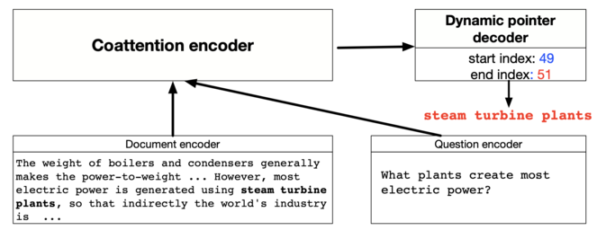
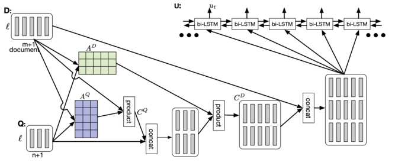
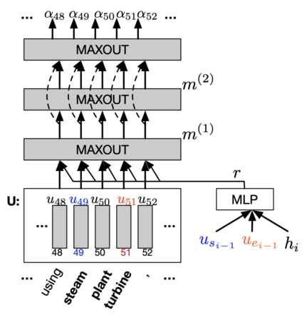

# Dynamic Coattention Networks
Implementation of the paper `"DYNAMIC COATTENTION NETWORKS FOR QUESTION ANSWERING"` in pytorch.

## Abstract 
Several deep learning models have been proposed for question answering. How- ever, due to their single-pass nature, they have no way to recover from local max- ima corresponding to incorrect answers. To address this problem, we introduce the Dynamic Coattention Network (DCN) for question answering. The DCN first fuses co-dependent representations of the question and the document in order to focus on relevant parts of both. Then a dynamic pointing decoder iterates over po- tential answer spans. This iterative procedure enables the model to recover from initial local maxima corresponding to incorrect answers. On the Stanford question answering dataset, a single DCN model improves the previous state of the art from 71.0% F1 to 75.9%, while a DCN ensemble obtains 80.4% F1.
  
## 1.Setup Instructions and Dependencies
You may setup the repository on your local machine by either downloading it or running the following line on `terminal`.
``` Batchfile
git clone https://github.com/h3lio5/dynamic-coattention-networks-pytorch.git
```
All dependencies required by this repository can be downloaded by creating a virtual environment with Python 3.7 and running
``` Batchfile
python3 -m venv .env
source .env/bin/activate
pip install -r requirements.txt
pip install -e .
```
All the data required to train and evaluate can be downloaded and preprocessed by running      
``` Batchfile
python dcn/utils/preprocess.py
```
## 2. Training Model from Scratch
To train your own model from scratch, run

```Batchfile
python train.py 
```
+ The parameters for your experiment are all set by defualt. But you are free to set them on your own by changing them in       the `config.py` file..
+ The training script will create a folder **checkpoints** as specified in your `config.py` file.
+ This folder will contain all model parameters saved after each epoch.
## 3.Repository Overview
This repository contains the following files and folders

1. **images**: Contains media for `readme.md`.

2. `dcn/data_loader.py`: Contains helper functions that load data.

3. `generate.py`: Used to generate style transfered text from trained models.

4. `dcn/model.py`: Contains code to build the model.

5. `requirements.txt`: Lists dependencies for easy setup in virtual environments.

6. `train.py`: Contains code to train models from scratch.

7. `dcn/utils/preprocess.py`: Contains code to download and preprocess data.

8. `dcn/utils/vocab.py`: Contains code to generate vocabulary and word embeddings.

9. `dcn/config.py` : Contains information about various file paths and model configurations.

## 4.Model Architecture

* ### Overview  
   

* ### Coattention Encoder         


* ### Dynamic Decoder        


* ### Highway Maxout Network          


## 5.TODO
[ ] Model Evaluation
